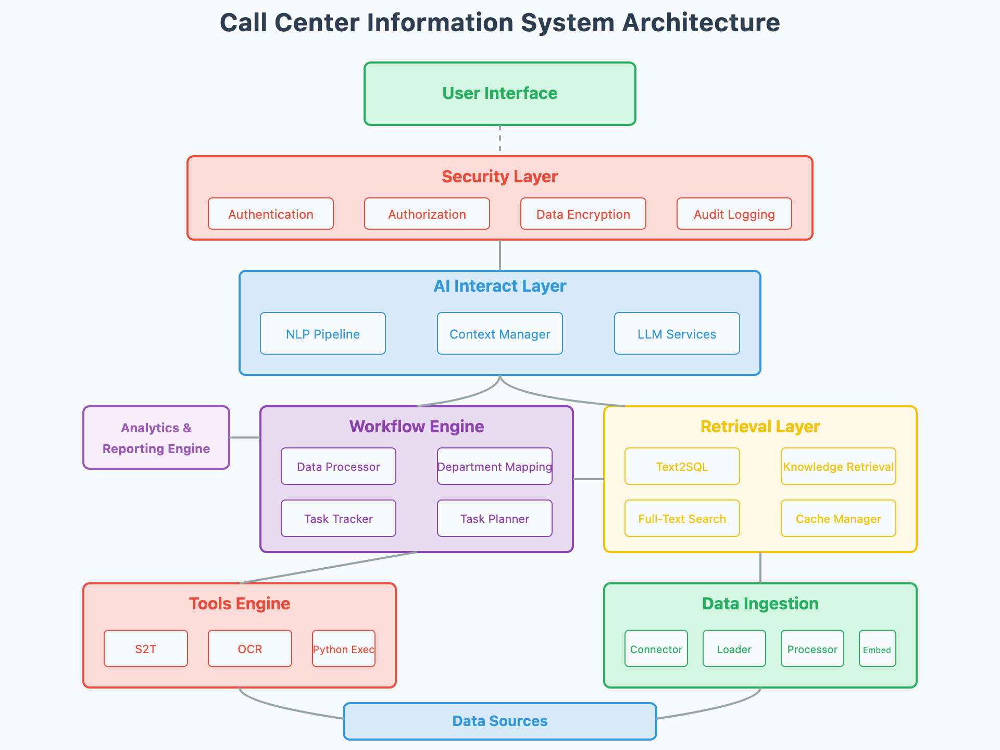

# Call Center Information System

An automated call center system for answering questions using AI, FastAPI, and gRPC.

## Architecture



This system follows a modular architecture with the following components:

- **User Interface**: Web interface and CLI for user interactions
- **Security Layer**: Authentication, authorization, data encryption, and audit logging
- **AI Interact Layer**: NLP pipeline, context manager, and LLM services
- **Workflow Engine**: Data processor, department mapping, task tracker, and task planner
- **Retrieval Layer**: Text2SQL, knowledge retrieval, full-text search, and cache manager
- **Tools Engine**: Various utility services implemented with gRPC
- **Data Ingestion**: Connectors, loaders, processors, and indexers
- **Data Sources**: External and internal data sources

## Features

- **Web Chat Interface**: Interactive UI with real-time processing feedback
- **CLI Chat Interface**: Command-line tool for asking questions
- **Knowledge Retrieval**: Find relevant information from vector databases
- **Text2SQL**: Convert natural language questions to SQL queries
- **Hybrid Mode**: Combine database and knowledge base results

## Setup and Installation

1. Clone the repository
2. Create a virtual environment:
   ```
   python -m venv venv
   source venv/bin/activate  # On Windows: venv\Scripts\activate
   ```
3. Install dependencies:
   ```
   pip install -r requirements.txt
   ```
4. Set up environment variables:
   ```
   cp .env.example .env
   # Edit .env file with your configurations
   ```
5. Start the application:
   ```
   # Using the run script
   ./run.sh
   
   # Or directly with uvicorn
   uvicorn app.main:app --reload
   ```

## Using the Web Interface

1. Open your browser and go to `http://localhost:8000`
2. Type your question in the input field
3. Select a mode:
   - **Knowledge Base**: Retrieves information from vector database
   - **Database**: Converts questions to SQL queries
   - **Hybrid**: Combines both approaches
4. View the thinking process in the right panel
5. See the answer with sources and any SQL queries generated

## Using the CLI

Run the CLI interactively:
```
# Using the run script
./run.sh cli

# Or directly with Python
python app/cli.py
```

Or ask a single question:
```
# Using the run script
./run.sh cli --question "What is the top selling product?" --mode hybrid

# Or directly with Python
python app/cli.py --question "What is the top selling product?" --mode hybrid
```

CLI Commands:
- `mode <knowledgebase|database|hybrid>`: Change the retrieval mode
- `exit`, `quit`, or `q`: Exit the CLI
- `Ctrl+C`: Exit the program

## Project Structure

```
app/
├── api/                 # FastAPI routes
│   └── v1/
│       └── endpoints/
│           └── chat.py  # Chat API endpoints
├── core/                # Core application settings
├── db/                  # Database models and connections
├── static/              # Static files for web interface
│   ├── css/
│   │   └── chat.css     # Chat UI styles
│   └── js/
│       └── chat.js      # Chat UI JavaScript
├── templates/           # HTML templates
│   └── chat.html        # Chat interface template
├── services/            # AI Interact Layer services
├── main.py              # FastAPI application
└── cli.py               # Command-line interface
retrieval_engine/        # Retrieval systems
├── knowledge_retrieval/ # Knowledge retrieval components
└── text2sql/            # Text2SQL components
llm_services/            # LLM integration
tools_engine/            # gRPC-based tool services
```

## Development

### Running tests
```
pytest
```

### Starting the gRPC services
```
python app/tools_engine/server.py
```

## API Documentation

API documentation is available at:
- Swagger UI: `http://localhost:8000/docs`
- ReDoc: `http://localhost:8000/redoc` 